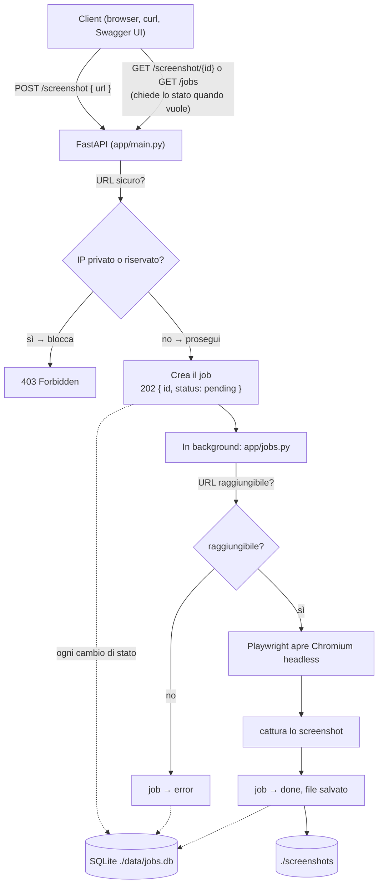

# url-screenshot-service

[](https://github.com/daniel-chiola/url-screenshot-service/actions/workflows/ci.yml)

Servizio containerizzato che riceve un URL via API REST, genera uno screenshot della pagina con Chromium headless (Playwright) e lo salva su file.

## Prerequisiti

- Docker e Docker Compose — [Docker Desktop](https://www.docker.com/products/docker-desktop/) o [OrbStack](https://orbstack.dev/) su macOS
- [uv](https://docs.astral.sh/uv/), solo se vuoi eseguirlo senza Docker:
  ```bash
  curl -LsSf https://astral.sh/uv/install.sh | sh
  ```

## Come avviarlo

```bash
git clone <url-di-questo-repository>
cd url-screenshot-service
```

### Con Docker (consigliato — non serve installare nient'altro)

```bash
docker compose up -d --build
```

Il servizio sarà su `http://localhost:8000`. Gli screenshot generati finiscono nella cartella `./screenshots`.

Altri comandi utili:

```bash
docker compose logs -f      # vedere i log in tempo reale
docker compose ps           # verificare che sia in esecuzione
docker compose down         # fermarlo
docker compose up -d --build  # riavviarlo dopo aver modificato il codice
```

### Senza Docker (con uv)

```bash
cp .env.example .env                                 # percorsi validi per l'esecuzione in locale
uv sync                                              # installa le dipendenze
uv run playwright install chromium --with-deps       # installa il browser
uv run --env-file .env uvicorn app.main:app --reload
```

`uv sync` legge `pyproject.toml`/`uv.lock` e installa tutto dentro `.venv/` (creato automaticamente): non serve attivare manualmente un virtual environment, né usare `pip install`.

### Aggiungere una dipendenza

```bash
uv add <nome-pacchetto>          # dipendenza del servizio (es. una nuova libreria usata da app/)
uv add --dev <nome-pacchetto>    # dipendenza solo per i test/sviluppo (es. un plugin di pytest)
```

`uv add` aggiorna sia `pyproject.toml` che `uv.lock` e installa subito il pacchetto in `.venv/`. Per rimuoverne una: `uv remove <nome-pacchetto>` (o `uv remove <nome-pacchetto> --group dev` se era stata aggiunta con `--dev`). Con Docker non serve fare nulla in più: l'immagine viene ricostruita da `pyproject.toml`/`uv.lock` al prossimo `docker compose up -d --build`.

## Come provarlo

### 1. Interfaccia web (il modo più semplice)

Apri **`http://localhost:8000`**: un form per inviare un URL, sotto una tabella con tutti i job e il loro stato in tempo reale, e un pannello con le metriche (job completati, in errore, tempo medio di completamento).

### 2. Documentazione interattiva

Apri **`http://localhost:8000/docs`**: pagina generata automaticamente da FastAPI per provare ogni endpoint dal browser.

### 3. Da terminale (curl)

```bash
# Verifica che il servizio sia attivo
curl http://localhost:8000/health

# Chiede uno screenshot (risponde subito con un id)
curl -X POST http://localhost:8000/screenshot \
  -H "Content-Type: application/json" \
  -d '{"url": "https://www.google.com"}'
# → {"id":"3f2...","status":"pending"}

# Controlla lo stato con l'id ricevuto sopra
curl http://localhost:8000/screenshot/3f2...

# Rimanda in coda un job fallito
curl -X POST http://localhost:8000/screenshot/3f2.../retry

# Vede tutti i job
curl http://localhost:8000/jobs

# Scarica lo screenshot generato
curl -o out.png http://localhost:8000/screenshots/screenshot_www_google_com.png

# Metriche: quanti job completati, quanti in errore, tempo medio di completamento
curl http://localhost:8000/stats
```

> Se hai impostato `API_KEY`, aggiungi `-H "X-API-Key: <la-tua-chiave>"` a ogni richiesta (tranne `/health`).

Opzioni facoltative per la cattura (tutte hanno un default):

```bash
curl -X POST http://localhost:8000/screenshot \
  -H "Content-Type: application/json" \
  -d '{
    "url": "https://www.google.com",
    "width": 1280,
    "height": 800,
    "full_page": false,
    "dark_mode": false,
    "block_ads": true
  }'
```

## Configurazione

| Variabile                | Default              | Cosa fa                                  |
|---------------------------|----------------------|-----------------------------------------------|
| `SCREENSHOTS_DIR`         | `/app/screenshots`   | Dove vengono salvati gli screenshot |
| `DB_PATH`                 | `/app/data/jobs.db`  | Dove viene salvato il file SQLite dei job |
| `MAX_CONCURRENT_CAPTURES` | `2`                  | Quanti screenshot possono essere generati insieme |
| `RATE_LIMIT`              | `5/minute`           | Quante richieste può fare un client per minuto |
| `API_KEY`                 | *(vuota)*            | Se impostata, protegge gli endpoint con una chiave (header `X-API-Key`). Vuota di default: nessuna autenticazione |

## Come funziona

Quando arriva una richiesta, il servizio **non fa aspettare il client** mentre genera lo screenshot (potrebbe metterci qualche secondo). Invece:

1. Risponde subito con un id e stato `pending`.
2. In background, genera davvero lo screenshot.
3. Il client controlla lo stato quando vuole, con quell'id.



Se un job finisce in `error` (es. sito irraggiungibile), resta salvato con l'errore: si può rimandarlo in coda con `POST /screenshot/{id}/retry`, senza doverlo ricreare da capo. Tutto quello che succede ai job (creazione, stato, errori) viene scritto su un file SQLite, così la coda non si perde se il container si riavvia.

## Componenti principali

- **`app/main.py`** — il server FastAPI: espone gli endpoint (`/screenshot`, `/jobs`, `/stats`, ecc.), controlla che l'URL sia sicuro, limita quante richieste può fare un client di seguito.
- **`app/jobs.py`** — la "regia": per ogni job, controlla che l'URL risponda, chiama Playwright per lo screenshot, aggiorna lo stato (`pending` → `processing` → `done`/`error`).
- **`app/db.py`** — salva e legge i job da un file SQLite (`./data/jobs.db`), così sopravvivono a un riavvio del container.
- **`app/screenshot.py`** — apre la pagina con Chromium (Playwright) e cattura l'immagine. Se la pagina impiega troppo a caricare, riprova automaticamente un paio di volte.
- **`app/security.py`** — controlla che l'URL richiesto non punti a un indirizzo "interno" (vedi sezione [Sicurezza](#sicurezza) sotto).
- **`app/utils.py`** — un paio di funzioni di supporto: genera il nome del file dello screenshot dall'URL, e controlla se un sito risponde prima di aprire il browser (più leggero che avviare Chromium per niente).
- **`app/config.py`** — tutte le impostazioni del servizio (letture da variabili d'ambiente), in un unico punto.
- **`app/static/index.html`** — una piccola pagina web per usare il servizio dal browser senza scrivere codice: un form per inviare un URL, una tabella che mostra tutti i job e un pannello con le metriche da `/stats`.

## Sicurezza

Questo servizio riceve un URL da chiunque e lo va a visitare. Il rischio principale si chiama **SSRF** (*Server-Side Request Forgery*): senza controlli, qualcuno potrebbe chiedere al servizio di visitare indirizzi che dovrebbero restare privati — ad esempio `localhost`, o la rete interna del server su cui gira, invece che un vero sito web pubblico.

Cosa fa il servizio per proteggersi:

- **Controlla il formato dell'URL** prima di tutto: se non è un URL valido (`http://` o `https://`), lo rifiuta subito (`422`).
- **Controlla l'indirizzo IP reale dietro l'URL**: risolve il dominio (es. `google.com` → un IP) e verifica che non sia un IP privato o riservato (come quelli usati dalle reti interne). Se lo è, rifiuta la richiesta (`403`) prima ancora di iniziare.
- **Ricontrolla anche durante la navigazione**: un sito "sicuro" al primo controllo potrebbe reindirizzare (redirect) verso un indirizzo interno. Per questo, ogni redirect viene ricontrollato da capo, non solo l'URL iniziale.
- **Chiave API opzionale**: impostando la variabile `API_KEY`, gli endpoint principali richiedono l'header `X-API-Key` con il valore giusto, altrimenti rispondono `401`. Di default è disattivata, per poter provare subito il servizio senza configurare nulla — va attivata se il servizio viene esposto pubblicamente.
- **Il container non gira come root**: se qualcuno riuscisse a compromettere il servizio, si ritroverebbe con i permessi di un utente limitato, non con accesso completo al sistema.

## Scelte tecniche (e perché)

- **Playwright** per fare gli screenshot: rispetto ad alternative come Selenium, ha un'API più moderna e gestisce da solo l'installazione del browser.
- **Nessuna coda esterna (no Redis/Kafka)**: per non far aspettare il client bastava eseguire la cattura "in background" nello stesso processo (`BackgroundTasks` di FastAPI). Aggiungere un sistema di messaggistica separato avrebbe significato più infrastruttura da gestire, senza un reale bisogno a questa scala (un solo servizio, poche richieste).
- **SQLite invece di un database vero e proprio (Postgres)**: stessa logica — è un singolo file, non serve un servizio server separato da avviare e configurare. Per un servizio che scrive pochi dati e non deve scalare su più server, è sufficiente.
- **Un endpoint di retry manuale (`POST /screenshot/{id}/retry`)** invece di un sistema automatico di ritenta-i-falliti: più semplice da capire e da usare, e i job falliti restano comunque visibili e recuperabili quando serve.
- **`uv`** per gestire le dipendenze Python invece di pip: è più veloce, soprattutto quando si reinstalla spesso (es. durante lo sviluppo o nella pipeline CI).
- **Un controllo HTTP invece di un "ping"** per vedere se un sito è raggiungibile: il ping spesso non funziona su hosting/cloud (bloccato dai firewall) anche quando il sito è perfettamente raggiungibile via browser.

## Struttura del progetto

```
.
├── .github/workflows/ci.yml   # Pipeline CI: build + test ad ogni push
├── app/
│   ├── main.py                # Server FastAPI: endpoint, sicurezza, limiti
│   ├── jobs.py                 # Regia dei job (stato, orchestrazione)
│   ├── db.py                    # Salvataggio dei job su SQLite
│   ├── screenshot.py          # Cattura screenshot con Playwright
│   ├── utils.py                # Funzioni di supporto
│   ├── security.py             # Controllo anti-SSRF
│   ├── config.py               # Impostazioni del servizio
│   ├── schemas.py              # Forma dei dati in ingresso/uscita
│   └── static/index.html      # Interfaccia web minimale
├── tests/                        # Test automatici (pytest)
├── screenshots/                 # Screenshot generati (cartella condivisa col container)
├── data/                         # File SQLite dei job (cartella condivisa col container)
├── Dockerfile                    # Build dell'immagine (produzione + test)
├── docker-compose.yml
├── pyproject.toml               # Dipendenze del progetto
└── uv.lock
```

## Test automatici

I test girano in un container Docker separato, così le librerie di test non finiscono mai nell'immagine di produzione:

```bash
docker compose --profile test run --build --rm tests
```

Genera due report in `test-reports/`: uno con l'esito di ogni test, uno con la percentuale di codice coperto dai test.

Ad ogni push su GitHub, la pipeline CI esegue lo stesso identico comando ([.github/workflows/ci.yml](.github/workflows/ci.yml)).

Senza Docker:

```bash
uv run pytest
```

> **Nota**: `app/screenshot.py` ha una copertura di test bassa (~33%) di proposito — la parte che apre davvero Chromium non viene testata con un browser vero (renderebbe i test lenti e meno affidabili), ma con un "finto" screenshot (mock). È una scelta, non una lacuna.

## Possibili miglioramenti futuri

Cose che lascerei fuori scope per questo progetto, ma che avrebbero senso se dovesse crescere:

- **Storage su cloud (es. S3)** invece che su disco locale: utile se il servizio dovesse girare su più container contemporaneamente, che oggi non potrebbero condividere la stessa cartella.
- **Autenticazione più solida** (es. OAuth2/JWT) al posto della semplice chiave API, se il servizio venisse esposto a più utenti con permessi diversi.
- **Metriche più complete** (es. Prometheus/Grafana): `GET /stats` oggi copre solo l'essenziale (job completati, in errore, tempo medio di completamento), letto direttamente da SQLite — niente storico nel tempo, solo lo stato attuale. Per quello servirebbe un sistema di monitoring vero e proprio, fuori scope per questo progetto (vedi sopra perché non l'ho aggiunto).
- **Test end-to-end con un browser reale**: la suite attuale non apre mai davvero Chromium (per restare veloce e affidabile); un secondo livello di test, più lento, potrebbe verificare anche quella parte.
